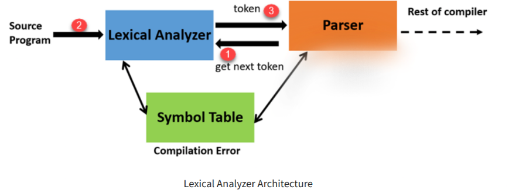

## Basic Terms 

### Token 
Tokens in compiler design are the sequence of characters which represents a unit of information in the source program.

### Lexeme
A lexeme is a sequence of characters that are included in the source program according to the matching pattern of a token. 
It is nothing but an instance of a token.

### Pattern 
A pattern is a description which is used by the token. 
In the case of a keyword which uses as a token, the pattern is a sequence of characters.

## An introduction to Lexical Analysis 
Lexical Analysis is the very first phase in the compiler designing.
A Lexer helps you to convert a sequence of characters into a sequence of tokens. 
Lexical analyzer scans the entire source code of the program. It identifies each token one by one.

## How tokens are recognized

## Flex & lexer.lex
[`src/lexer.lex`](../src/lexer.lex) contains the lexer. In general a lexical analyser can be described by a set of regular expressions related to the actions to be performed when one matches some part of the source code.

Flex is a lexer generator used to compile the lexer.lex file into C code, the `lexer.cc` file. Although we make Flex emit C code, we use a C++ file extension for uniformity with the rest of the compiler. There are three sections of a Flex lexer file, separated by `%%`s:

The first section primarily contains any `#include` directives and statements that one would want to be present for all the code below to see. This is also where `%option` statements can be used. Details about them can be found in the Flex documentation. When using Flex alongside Bison, we also include a header file generated by Bison so that the lexer can use the token types defined in the parser file.

The second section contains the meat of the lexer: the regular expression and action pairs. They're pretty intuitive to understand. For details about variables such as `yylval`, `yytext`, etc. you may refer to the Flex/Bison documentation.

The third section usually contains definitions for general functions used in or related to the lexer. This section is completely C or C++ code and is copied as is into the generated C file.
