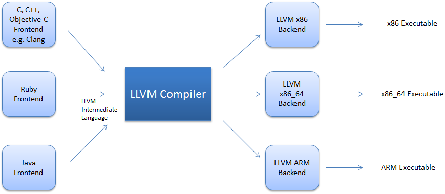

# LLVM Codegen
In [`src/llvmcodegen.cc`](../src/llvmcodegen.cc), we recursively traverse the tree and generate equivalent LLVM IR.

## An introduction to LLVM
LLVM is a very popular compiler infrastructure for C and other languages, including Rust. LLVM can provide the middle layers of a complete compiler system, taking intermediate representation (IR) code from a compiler and emitting an optimized IR. This new IR can then be converted and linked into machine-dependent assembly language code for a target platform.



We will be using the LLVM toolchain to convert our baseline language into LLVM IR.

## LLVM IR
The core of LLVM is the intermediate representation (IR), a low-level programming language similar to assembly. IR is a strongly typed reduced instruction set computer (RISC) instruction set which abstracts away most details of the target(e.g. x86 ISA). Also, instead of a fixed set of registers, IR uses an infinite set of temporaries of the form %0, %1, etc. LLVM IR follows static single assignment form.([SSA](https://en.wikipedia.org/wiki/Static_single-assignment_form)). SSA requeries each variable to be assigned exactly once. For example,

```
y := 1
y := 2
x := y
```

would be written in SSA form as,

```
y1 := 1
y2 := 2
x := y2
```

SSA allows many compiler optimizations (like [constant folding](https://en.wikipedia.org/wiki/Constant_folding) e.g. converting `a = 3 * 4 + 5` into `a = 17`). It is important to note that our baseline language is not in SSA. The LLVM toolchain has the functionality that allows us to generate SSA withought worrying too much about generating fresh variables for new assignments. The C code,

```C
int main() {
    int abc = 123 * 20 + 20 + (22 / 2) - 3;
    abc = abc + abc;
    return 0;
}
```

turns into the following LLVM IR:

```llvm
define i32 @main() {
entry:
    %abc = alloca i32
    store i32 2488, i32* %abc
    %abc1 = load i32, i32* %abc
    %abc2 = load i32, i32* %abc
    %addtmp = add i32 %abc1, %abc2
    store i32 %addtmp, i32* %abc
    ret i32 0
}
```

## Code generation with the LLVM API
Let us try to generate the following C code's IR using the LLVM API.

```C
int main() {
    int abc = 123;
    abc = abc + abc;
    return 0;
}
```

We first create these three variables:

```C++
using namespace llvm;

LLVMContext context;
IRBuilder<> builder(context);
Module module;
```

- `context` is an object that owns a lot of core LLVM data structures. We don’t need to understand it in detail, we just need a single instance to pass into APIs that require it.
- `builder` is a helper object that makes it easy to generate LLVM instructions. Instances of the IRBuilder class template keep track of the current place to insert instructions and has methods to create new instructions.
- `module` is an LLVM construct that contains functions and global variables. In many ways, it is the top-level structure that the LLVM IR uses to contain code.

We now can talk about generating C code. The first thing to tackle is the function:

```C
int main() {...
```

A function declaration and definition involves in C involves writing down its type and its body. We will do exactly that in LLVM. We first create the type of the main function which is a function that takes nothing and returns an int:

```C++
FunctionType *main_func_type = FunctionType::get(
    builder.getInt32Ty(), {}, false
);
```

`FunctionType::get` creates a function type. The first argument in `FunctionType::get` is the return type which is in our case is a 32bit integer, the second argument is the list of argument types, which inn our case is null, and the last argument specifies if a function can take a variable number of arguments, like `printf`, which in our case is false. Now that we have the type we can create the function declaration.

```C++
Function *main_func = Function::Create(
    main_func_type,
    GlobalValue::ExternalLinkage,
    "main",
    &module
);
```

`Function::Create` creates the declaration of a function. The first argument in `Function::Create` is the type of the function. The second argument is the type of the function. The third argument is the name of the function, and the last is which module this function is going to be a part of. Now we only have the declaration of the function. We need to attach the body of the function to the declaration.

```C++
BasicBlock *main_func_entry_bb = BasicBlock::Create(
    *context,
    "entry",
    main_func
);
```
We do this by using `BasicBlock::Create`. The first argument is a reference to the context, the second is the name of the block, and the third argument is the function to which it is being attached to. We then have to set the builder to the start of this block.

```C++
builder.SetInsertPoint(main_func_entry_bb);
```

We now how to generate code for the snippet,

```C
    ...
    int abc = 123;
    ...
```

`abc` is a local stack variable for the function `main`. We can declare stack variables in LLVM using the `alloca` instruction in LLVM IR.

```C++
AllocaInst *alloca_abc = builder.CreateAlloca(builder.getInt32Ty(), 0, "abc");
```

The `CreateAlloca` method of the `builder` object takes the type of the local stack variable and its name. But this creates the declaration of `abc`, we also need to initialize `abc` with `123`. We can do that with LLVM IR's `store` instruction. 

```C++
Value *const_123 = builder.getInt32(0);
builder.CreateStore(const_123, alloca_abc);
```

The `CreateStore` method's first argument is the value being store, and the second argument is local stack variable the value is being stored in. Now we need to generate the IR for this arithmetic expression.

```C
    ...
    abc = abc + abc;
    ...
```

We can't use local stack variables directly, we have load them into temperory registers. We can do this using the `load` instruction in LLVM IR.

```C++
Value *abc1 = builder.CreateLoad(builder.getInt32Ty(), alloca_abc, "abc");
Value *abc2 = builder.CreateLoad(builder.getInt32Ty(), alloca_abc, "abc");
```

The `CreateLoad` method takes the type of the register as its first argument (which is also the type of the local stack variable), the alloca instruction as its second, and the name of the identifier as its third.  We call it two times for both the register variables we need to make. Now we need to add both of these register variables. We can do this with LLVM IR's `add` instruction. 

```C++
Value *result = builder.CreateAdd(abc1, abc2, "result");
```

The `CreateAdd` method's first argument and second argument are the first and second operands of the addition, and the third argument is the name of register variable which holds the result. Nowe simply store this result back into `abc`...

```C++
builder.CreateStore(result, alloca_abc);
```

... and we end this with a return statement.

```C++
builder.CreateRet(builder.getInt32(0));
```

The code in the [`src/llvmcodegen.cc`](../src/llvmcodegen.cc) does exactly what we did in the example above but it recursively generates the IR following the Abstract Syntax Tree generated by the parser. This was a basic introduction to using the LLVM API for generating LLVM IR.

# Useful Links
1. [LLVM's official tutorial](https://llvm.org/docs/tutorial/MyFirstLanguageFrontend/index.html)